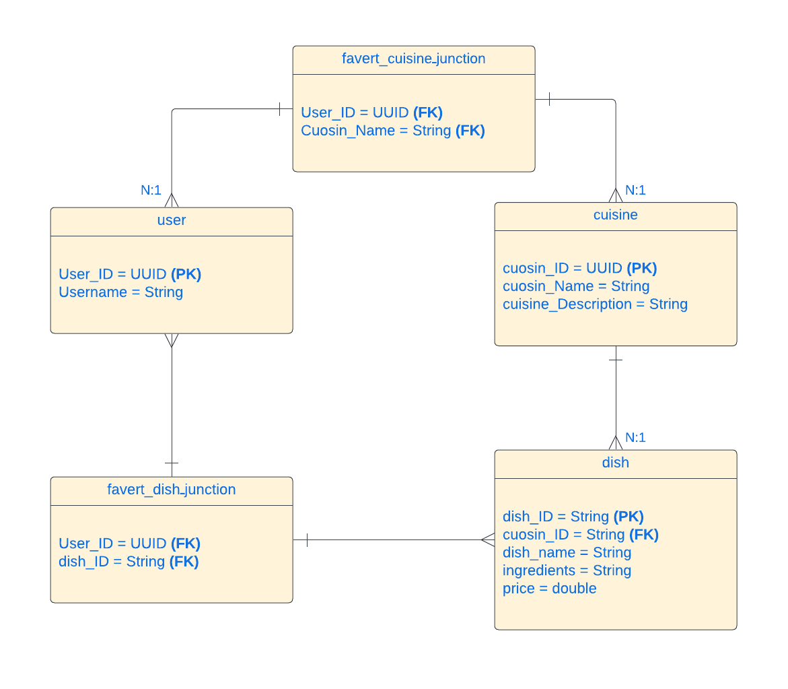

# Cuisines API  
The Cuisines API is a RESTful web service built with Swift and Vapor, leveraging Fluent for seamless database operations. It provides backend functionality for managing a cuisine database, utilizing PostgreSQL (PSQL) as the primary data storage.

# APP OVERVIEW  
A RESTful API connected to a PSQL database, designed to support recipe management for an iOS app.

# MAIN FEATURES  
- **Create Operation [POST]:**  
  - Allows the addition of new users, dishes, or cuisines into the database through POST requests.
  
- **Retrieve Operations [GET]:**  
  - Fetch all users, dishes, and cuisines.
  - Retrieve specific records (user, dish, cuisine) by their unique ID.

- **Update and Delete Operations [PUT, DELETE]:**  
  - Modify existing users, dishes, or cuisines with PUT requests.
  - Remove records from the database using DELETE requests.

# TECHNOLOGIES  
- **Swift**: Core programming language.  
- **Vapor**: Web framework for building the API.  
- **Fluent**: ORM for database interaction.  
- **PostgreSQL**: The database management system.

# DATABASE Schema:  

  

# Authors:  
I would like to extend my sincere thanks to my exceptional team members, Haifa Muhammad, and Nouf Sultan, for their invaluable contributions and collaboration throughout this project. Working with both of you has been a true pleasure, and I thoroughly enjoyed every moment of our teamwork.🩵
